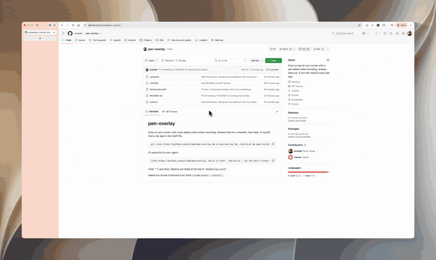

# pen-overlay

Draw on your screen with a pen tablet while screen recording. Strokes hold for a moment, then fade. A macOS menu-bar app in one Swift file.



```
git clone https://github.com/prslade/pen-overlay && cd pen-overlay && ./build.sh && open build/PenOverlay.app
```

Or paste this to your agent:

```
Clone https://github.com/prslade/pen-overlay, build it with `./build.sh`, run the built binary with `--selftest`, then launch it.
```

Hold ⌃⌥ and draw. Options are listed at the top of `PenOverlay.swift`.

Needs the Xcode Command Line Tools (`xcode-select --install`).
